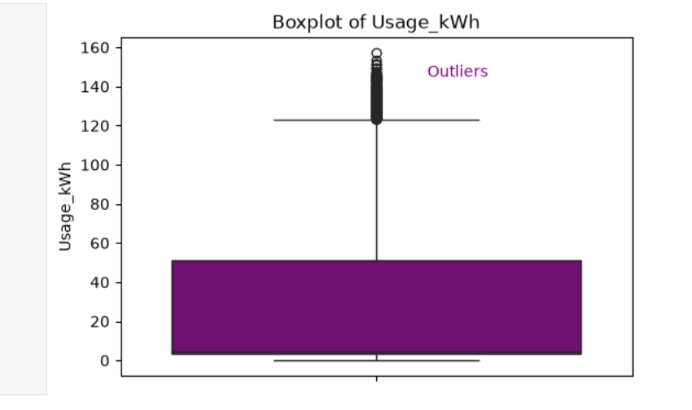
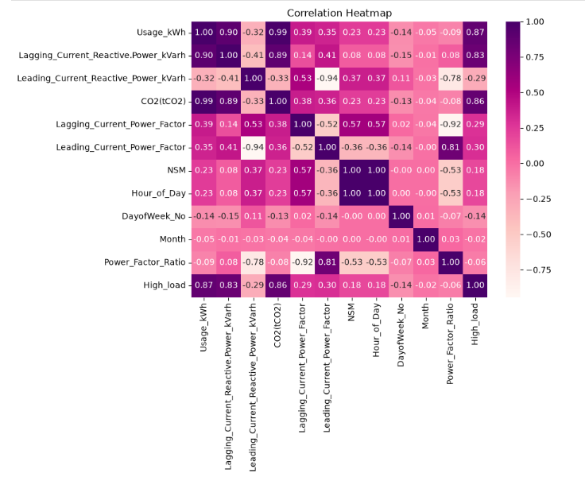
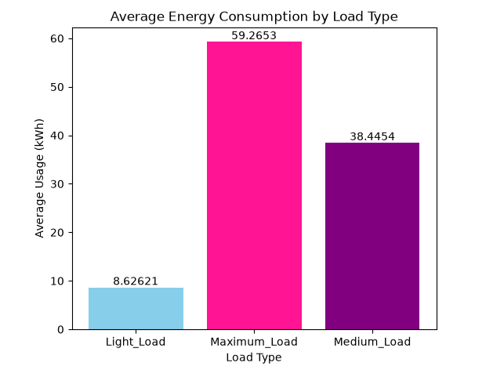
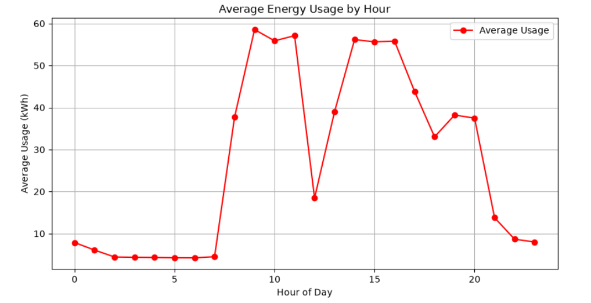
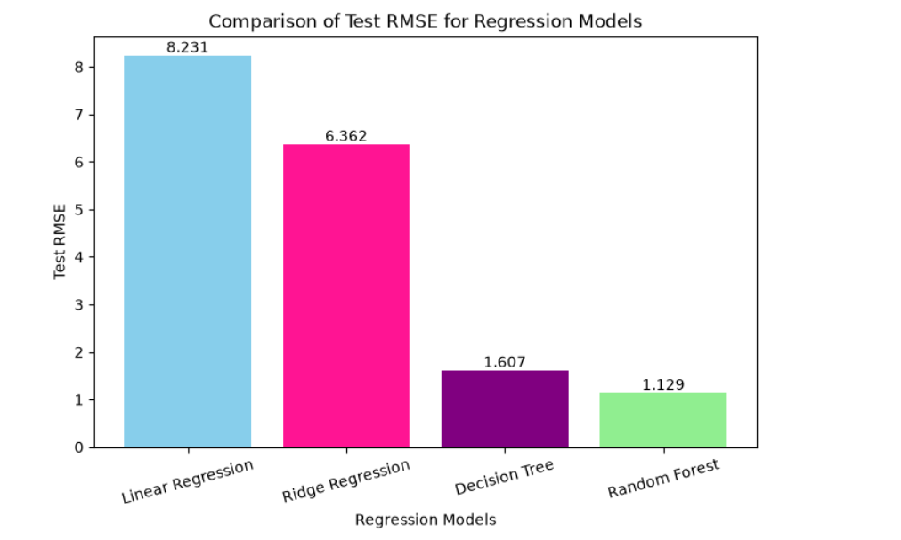
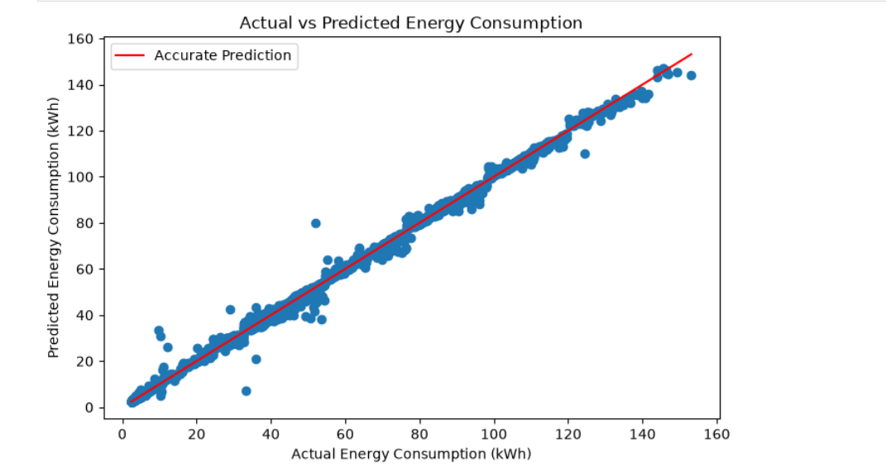
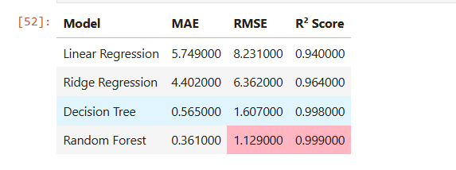

# Steel_Energy_Consumption_Modelling

## 📌 Project Overview

This project focuses on predicting electricity energy consumption in a steel manufacturing industry using machine learning regression models. The project consists of two major parts:
- **Part 1:** Exploratory Data Analysis (EDA) and Feature Engineering  - **week2_eda.ipynb**
- **Part 2:** Regression Model Development and Evaluation - **week2 baseline models.ipynb**
  
## 🎯Objective

- Perform data cleaning, feature engineering, and exploratory data analysis.
- Analyze patterns and relationships affecting energy consumption.
- Train multiple regression models for energy consumption prediction.
- Compare model performance and select the best-performing model.

## 📊 Dataset Information

**Dataset:** Steel Industry Energy Consumption Dataset

The dataset contains electricity consumption records collected from a steel manufacturing plant.

### Target Variable

- **Usage_kWh**

### Important Features

- Date
- Lagging_Current_Reactive.Power_kVarh
- Leading_Current_Reactive_Power_kVarh
- CO2(tCO2)
- Lagging_Current_Power_Factor
- Leading_Current_Power_Factor
- NSM (Number of Seconds from Midnight)
- WeekStatus
- Day_of_week
- Load_Type

The dataset contains both numerical and categorical variables, making it suitable for regression modeling after preprocessing.

## 🛠 Environment Setup

### Clone the repository

```bash
git clone https://github.com/yourusername/Steel-Energy-Prediction.git
cd Steel-Energy-Prediction
```
### Install required libraries

```bash
pip install -r requirements.txt
```

## 🔧 Feature Engineering
To improve model performance several preprocessing and feature engineering steps were performed.

### Date Processing
Converted Date column into date time format
Extracted:
   - Hour 
   - Day 
   - Month
   - Week status

### Created New Features

#### 1. Power Factor Ratio

A new feature representing the relationship between leading and lagging power factors.

#### 2. High_Load

Created using the 75th percentile of Usage_kWh.

- Values above the threshold → High Load
- Remaining values → Normal Load

### Categorical Encoding

One-Hot Encoding was applied to categorical variables before model training.

## 📈 Exploratory Data Analysis (EDA)

To understand the dataset several visualizations were created.

### Data Quality

- No missing values in original dataset
- No duplicate records
- Date column successfully converted

### Outlier Detection

- IQR Method used for outlier detection.
- Visualized using boxplot.

<h3>Box Plot</h3>
<p align="center">
  
</p>

### Correlation Analysis

- Correlation heatmap is used to identify relationships among numerical variables.
- Strong correlations identified the most influential features.

<h3>Correlation Heatmap</h3>
<p align="center">
  

### Load Type Analysis

- Grouped bar chart showed average electricity usage across different load categories.

<h3>Grouped Bar Chart</h3>
<p align="center">
  
</p>

### Hourly Energy Consumption

- A line chart illustrated changes in average energy consumption throughout the day.

<h3>Line Chart</h3>
<p align="center">
  
</p>

## 🤖 Machine Learning Models

The regression algorithms implemented were:
- Linear Regression
- Ridge Regression
- Decision Tree Regressor
- Random Forest Regressor

The dataset was divided into:
- 80% training
- 20% testing

## 📊 Model Evaluation

The trained regression models were evaluated using multiple performance metrics to assess prediction accuracy and generalization ability.

### Evaluation Metrics

- Mean Absolute Error (MAE)
- Root Mean Squared Error (RMSE)
- R² Score

Additionally, **5-Fold Cross-Validation** was performed to measure the stability and robustness of each model across different data splits.

## 📈 Model Performance Comparison

The figure below compares the **Test RMSE** of all regression models. A lower RMSE indicates better predictive performance.

<h3>RMSE Comparison</h3>
<p align="center">
  
</p>

## 🎯 Predicted vs Actual Values

The scatter plot below compares the predicted values with the actual energy consumption values for the best-performing model. Points closer to the red reference line indicate more accurate predictions.

<h3>Scattered Plot</h3>
<p align="center">
  
</p>

## 🏆 Results

After comparing all regression models:

- Random Forest Regressor achieved the best overall performance.
- It produced the lowest prediction error.
- It achieved the highest R² score.
- Cross-validation confirmed that the model generalized well on unseen data.

<h3>Results Table</h3>
<p align="center">
  
</p>

## ✅ Conclusion

This project demonstrates a complete machine learning workflow, starting from data exploration and feature engineering to regression model development and evaluation.

### Key Achievements

- Comprehensive exploratory data analysis
- Meaningful feature engineering
- Multiple regression models trained and compared
- Model evaluation using several performance metrics
- Cross-validation for reliable performance estimation
- Selection of the best-performing model based on RMSE and R² score

## ▶️ Execution Order

1. Run **`week2_eda.ipynb`** first to perform EDA, feature engineering, and generate the engineered dataset.
2. Run **`week2_baseline_models.ipynb`** next, as it uses the engineered dataset created in the first notebook.

## Repositry Structure:

```text
Steel_Energy_Consumption_Modelling/
│
├── data/
│   ├── Steel_industry_data.csv
│   └── Steel_industry_engineered.csv
│
├── images/
│   ├── heatmap.png
│   ├── boxplot.png
│   ├── grouped_bar_chart.png
│   ├── line_chart.png
│   ├── rmse_comparison.png
│   ├── mean_rmse_comparison.png
│   ├── results_table.png
│   └── scattered_plot.png
│
├── week2_eda.ipynb
├── week2_baseline_models.ipynb
├── requirements.txt
└── README.md
```

## 👩‍💻 Author
**Areeba Amjad**
BS Bioinformatics
National University of Sciences and Technology (NUST)
